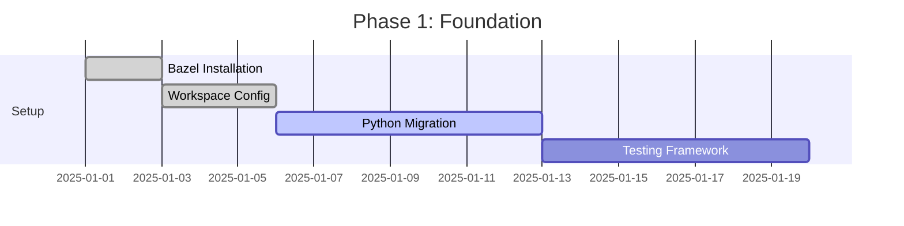
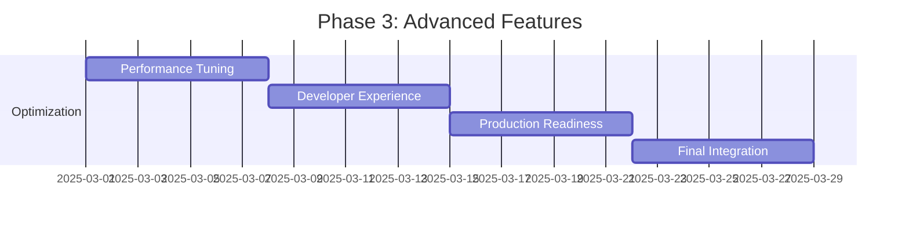

# Polyglot Monorepo Migration Plan: Aitudes → Bazel

## Executive Summary

This document outlines the strategic migration of the Aitudes Python AI agents project into a polyglot monorepo using Bazel as the primary build system. The migration will enable multi-language support, improve build performance, ensure reproducible builds, and create a scalable foundation for future development.

## 1. Current State Analysis

### 1.1 Project Overview

- **Primary Language**: Python 3.11+
- **Core Focus**: AI agents framework with LLM integrations
- **Build System**: UV + pip (Python-centric)
- **Dependencies**: OpenAI, Google AI, Hugging Face, Smolagents
- **Structure**: Single-language monorepo with lib-based organization

### 1.2 Current Architecture

```text
aitudes/
├── libs/swarm/          # Core agent framework
├── mcp-servers/         # Model Context Protocol servers
├── notebooks/           # Jupyter notebooks for experimentation
├── smolagents/          # Agent implementations
├── pyproject.toml       # Python dependencies
├── requirements.txt     # Legacy dependency file
└── uv.lock             # UV lock file
```

### 1.3 Technical Debt & Pain Points

- **Language Lock-in**: Currently Python-only limits integration opportunities
- **Build Performance**: No incremental builds or caching
- **Dependency Management**: Multiple Python-specific tools (UV, pip, poetry potential)
- **Testing**: No structured test framework visible
- **CI/CD**: Limited to Python toolchain

## 2. Target Architecture

### 2.1 Polyglot Language Strategy

#### Phase 1 Languages (Immediate)

- **Python** - Maintain existing AI/ML core
- **TypeScript/JavaScript** - Web interfaces, tooling, and Node.js services
- **Go** - High-performance services, CLI tools, and microservices

#### Phase 2 Languages (Future)

- **Rust** - Performance-critical components, WASM modules
- **C++** - Native extensions, GPU acceleration
- **Java/Kotlin** - Enterprise integrations, Android components

### 2.2 Monorepo Structure

```text
aitudes/
├── WORKSPACE              # Bazel workspace definition
├── BUILD.bazel           # Root build file
├── .bazelrc              # Bazel configuration
├── .bazelversion         # Bazel version pinning
├── MODULE.bazel          # Bzlmod module definition
├── tools/                # Build tools and scripts
│   ├── BUILD.bazel
│   ├── python/           # Python toolchain configs
│   ├── typescript/       # TS/JS toolchain configs
│   └── go/               # Go toolchain configs
├── libs/                 # Shared libraries
│   ├── agent-core/       # Core agent abstractions (Python)
│   ├── llm-client/       # LLM client libraries (Python/TypeScript)
│   ├── mcp-protocol/     # MCP protocol implementations
│   └── shared-types/     # Cross-language type definitions
├── services/             # Microservices
│   ├── agent-runtime/    # Agent execution service (Python)
│   ├── api-gateway/      # API gateway (Go)
│   ├── web-ui/          # Web interface (TypeScript/React)
│   └── model-proxy/     # Model proxy service (Go)
├── apps/                # Applications
│   ├── cli/             # Command-line interface (Go)
│   ├── desktop/         # Desktop application (Electron/TypeScript)
│   └── notebooks/       # Jupyter notebooks (Python)
├── packages/            # Language-specific packages
│   ├── python/          # Python packages
│   ├── npm/             # NPM packages
│   └── go/              # Go modules
├── tests/               # Integration and e2e tests
├── docs/                # Documentation
├── deployment/          # Deployment configurations
└── examples/            # Example implementations
```

### 2.3 Build System Architecture

#### 2.3.1 Bazel Rules and Extensions

- **rules_python**: Python support with pip integration
- **rules_nodejs**: TypeScript/JavaScript support
- **rules_go**: Go support with module management
- **rules_rust**: Future Rust support
- **rules_docker**: Container image building
- **rules_k8s**: Kubernetes deployment

#### 2.3.2 Build Targets Strategy

```python
# Example BUILD.bazel structure
py_library(
    name = "agent_core",
    srcs = glob(["**/*.py"]),
    deps = [
        "//libs/llm-client:python",
        "@pypi//openai",
        "@pypi//loguru",
    ],
)

go_binary(
    name = "api_gateway",
    srcs = ["main.go"],
    deps = [
        "//libs/mcp-protocol:go",
        "@com_github_gin_gonic_gin//:gin",
    ],
)

ts_project(
    name = "web_ui",
    srcs = glob(["src/**/*.ts", "src/**/*.tsx"]),
    deps = [
        "@npm//react",
        "@npm//typescript",
    ],
)
```

## 3. Migration Strategy

### 3.1 Phase 1: Foundation & Core Migration (Weeks 1-4)

#### Week 1: Bazel Setup & Basic Configuration

- [ ] Install Bazel and configure `.bazelversion`
- [ ] Create `WORKSPACE` and `MODULE.bazel` files
- [ ] Set up basic `.bazelrc` with optimization flags
- [ ] Configure Python rules and migrate core `libs/swarm`
- [ ] Create initial `BUILD.bazel` files for existing Python code

#### Week 2: Dependency Management Migration

- [ ] Convert `pyproject.toml` dependencies to Bazel `pip.parse()`
- [ ] Create `requirements.txt` lock file for Bazel
- [ ] Set up hermetic Python toolchain
- [ ] Migrate existing Python tests to `py_test` targets
- [ ] Validate existing functionality works under Bazel

#### Week 3: Build System Integration

- [ ] Create `tools/` directory with build utilities
- [ ] Set up pre-commit hooks for Bazel formatting
- [ ] Configure IDE integration (VS Code, IntelliJ)
- [ ] Create initial CI/CD pipeline with Bazel
- [ ] Document build commands and workflows

#### Week 4: TypeScript Introduction

- [ ] Add `rules_nodejs` to WORKSPACE
- [ ] Create basic TypeScript project structure
- [ ] Set up shared type definitions between Python and TypeScript
- [ ] Create TypeScript client for existing Python APIs
- [ ] Implement basic web UI for agent interaction

### 3.2 Phase 2: Service Decomposition (Weeks 5-8)

#### Week 5: Go Service Development

- [ ] Add `rules_go` to WORKSPACE
- [ ] Create API gateway service in Go
- [ ] Implement health checks and monitoring endpoints
- [ ] Set up inter-service communication protocols
- [ ] Create CLI tool for agent management

#### Week 6: Microservices Architecture

- [ ] Extract agent runtime as standalone service
- [ ] Implement model proxy service for LLM API management
- [ ] Set up service discovery and configuration management
- [ ] Create Docker containers for each service
- [ ] Implement inter-service authentication

#### Week 7: Testing Infrastructure

- [ ] Set up integration testing framework
- [ ] Create end-to-end test suites
- [ ] Implement load testing for services
- [ ] Set up test data management
- [ ] Configure test environments

#### Week 8: Advanced Build Features

- [ ] Implement remote caching for build artifacts
- [ ] Set up build performance monitoring
- [ ] Create custom Bazel rules for AI/ML workflows
- [ ] Implement model versioning and deployment
- [ ] Set up artifact management

### 3.3 Phase 3: Advanced Features & Optimization (Weeks 9-12)

#### Week 9: Performance Optimization

- [ ] Implement Rust modules for performance-critical paths
- [ ] Add GPU acceleration support
- [ ] Optimize memory usage across services
- [ ] Implement connection pooling and caching
- [ ] Set up performance benchmarking

#### Week 10: Developer Experience

- [ ] Create comprehensive documentation
- [ ] Set up developer onboarding automation
- [ ] Implement hot-reloading for development
- [ ] Create debugging and profiling tools
- [ ] Set up local development environment

#### Week 11: Production Readiness

- [ ] Implement comprehensive monitoring and alerting
- [ ] Set up log aggregation and analysis
- [ ] Create disaster recovery procedures
- [ ] Implement security scanning and compliance
- [ ] Set up automated deployment pipelines

#### Week 12: Final Integration & Launch

- [ ] Conduct full system testing
- [ ] Migrate production workloads
- [ ] Train team on new architecture
- [ ] Create runbooks and operational procedures
- [ ] Plan post-migration optimization

## 4. Technical Considerations

### 4.1 Build System Design Principles

#### 4.1.1 Hermeticity

- **Hermetic Builds**: All dependencies explicitly declared
- **Toolchain Management**: Pinned versions for all languages
- **Environment Isolation**: No reliance on host system tools
- **Reproducible Builds**: Same inputs always produce same outputs

#### 4.1.2 Incrementality

- **Fine-grained Dependencies**: Minimal rebuild scope
- **Caching Strategy**: Aggressive caching of build artifacts
- **Parallel Execution**: Maximize build parallelism
- **Remote Execution**: Distribute builds across multiple machines

#### 4.1.3 Scalability

- **Modular Architecture**: Independent buildable components
- **Lazy Loading**: Load only required dependencies
- **Resource Management**: Efficient memory and CPU usage
- **Network Optimization**: Minimize network I/O

### 4.2 Language-Specific Considerations

#### 4.2.1 Python Integration

```python
# Migration strategy for Python dependencies
load("@rules_python//python:pip.bzl", "pip_parse")

pip_parse(
    name = "pypi",
    requirements_lock = "//tools/python:requirements.txt",
    python_interpreter_target = "@python3_11//:python",
)

# AI/ML specific considerations
py_library(
    name = "ml_models",
    srcs = ["models.py"],
    data = [
        "//data:model_weights",  # Large model files
        "//data:tokenizers",     # Tokenizer data
    ],
    deps = [
        "@pypi//torch",
        "@pypi//transformers",
        "@pypi//numpy",
    ],
)
```

#### 4.2.2 TypeScript Integration

```typescript
// Build configuration for TypeScript projects
ts_config(
    name = "tsconfig",
    src = "tsconfig.json",
    deps = [
        "//libs/shared-types:types",
    ],
)

ts_project(
    name = "agent_client",
    srcs = glob(["src/**/*.ts"]),
    declaration = True,
    tsconfig = ":tsconfig",
    deps = [
        "@npm//axios",
        "@npm//ws",
        "//libs/shared-types:npm_package",
    ],
)
```

#### 4.2.3 Go Integration

```go
// Go service with Protocol Buffers
go_library(
    name = "agent_service",
    srcs = [
        "server.go",
        "handlers.go",
    ],
    importpath = "github.com/aitudes/services/agent",
    deps = [
        "//libs/mcp-protocol:go_proto",
        "@com_github_grpc_grpc_go//:go_default_library",
        "@org_golang_google_protobuf//proto:go_default_library",
    ],
)

go_binary(
    name = "agent_server",
    embed = [":agent_service"],
)
```

### 4.3 Data Management Strategy

#### 4.3.1 Model Assets

- **Large File Handling**: Git LFS integration for model weights
- **Versioning**: Semantic versioning for model releases
- **Distribution**: CDN-based model distribution
- **Caching**: Local model caching for development

#### 4.3.2 Configuration Management

- **Environment-specific Configs**: Separate configs per environment
- **Secret Management**: Integration with secret management systems
- **Feature Flags**: Runtime feature toggling
- **A/B Testing**: Configuration-driven experimentation

### 4.4 Cross-Language Integration

#### 4.4.1 Protocol Buffers

```protobuf
// Shared protocol definitions
syntax = "proto3";

package aitudes.agent.v1;

service AgentService {
  rpc CreateAgent(CreateAgentRequest) returns (Agent);
  rpc ChatWithAgent(ChatRequest) returns (ChatResponse);
  rpc ListAgents(ListAgentsRequest) returns (ListAgentsResponse);
}

message Agent {
  string id = 1;
  string name = 2;
  string model = 3;
  map<string, string> config = 4;
  google.protobuf.Timestamp created_at = 5;
}
```

#### 4.4.2 API Gateway Pattern

- **Unified Interface**: Single entry point for all services
- **Load Balancing**: Distribute requests across service instances
- **Rate Limiting**: Protect services from overload
- **Authentication**: Centralized authentication and authorization

#### 4.4.3 Event-Driven Architecture

- **Message Queues**: Asynchronous communication between services
- **Event Sourcing**: Audit trail of all system changes
- **CQRS Pattern**: Separate read and write models
- **Saga Pattern**: Distributed transaction management

## 5. Architecture Patterns & Best Practices

### 5.1 Service Design Patterns

#### 5.1.1 Domain-Driven Design (DDD)

- **Bounded Contexts**: Clear service boundaries
- **Aggregate Roots**: Consistent data models
- **Domain Events**: Business logic encapsulation
- **Repository Pattern**: Data access abstraction

#### 5.1.2 SOLID Principles Application

- **Single Responsibility**: Each service has one clear purpose
- **Open/Closed**: Extensible without modification
- **Liskov Substitution**: Interchangeable implementations
- **Interface Segregation**: Focused interfaces
- **Dependency Inversion**: Depend on abstractions

#### 5.1.3 Microservices Patterns

- **Circuit Breaker**: Prevent cascade failures
- **Bulkhead**: Isolate critical resources
- **Timeout**: Prevent hanging requests
- **Retry with Backoff**: Graceful failure handling
- **Health Checks**: Service monitoring

### 5.2 Build Optimization Strategies

#### 5.2.1 Dependency Graph Optimization

```python
# Example of optimized dependency structure
py_library(
    name = "agent_core",
    srcs = ["agent.py"],
    deps = [
        "//libs/llm-client:interface",  # Interface only
    ],
)

py_library(
    name = "agent_runtime",
    srcs = ["runtime.py"],
    deps = [
        ":agent_core",
        "//libs/llm-client:openai_impl",  # Specific implementation
    ],
)
```

#### 5.2.2 Build Performance Metrics

- **Build Time Tracking**: Monitor build duration trends
- **Cache Hit Rates**: Optimize caching strategies
- **Resource Usage**: Memory and CPU utilization
- **Parallelism**: Identify bottlenecks in parallel execution

#### 5.2.3 Remote Caching Configuration

```python
# .bazelrc configuration for remote caching
build --remote_cache=https://cache.company.com
build --remote_timeout=60
build --remote_retries=3
build --remote_upload_local_results=true
```

### 5.3 Testing Strategy

#### 5.3.1 Test Pyramid Implementation

- **Unit Tests**: Fast, isolated component tests
- **Integration Tests**: Service interaction tests
- **End-to-End Tests**: Full system workflow tests
- **Performance Tests**: Load and stress testing

#### 5.3.2 Test Data Management

```python
# Test data as Bazel targets
filegroup(
    name = "test_models",
    srcs = glob(["testdata/models/*.json"]),
)

py_test(
    name = "agent_test",
    srcs = ["agent_test.py"],
    data = [":test_models"],
    deps = [
        ":agent_core",
        "@pypi//pytest",
    ],
)
```

#### 5.3.3 Mock and Stub Strategy

- **Service Mocking**: Mock external dependencies
- **Data Stubbing**: Consistent test data
- **Environment Isolation**: Isolated test environments
- **Contract Testing**: API contract validation

## 6. Risk Assessment & Mitigation

### 6.1 Technical Risks

#### 6.1.1 Migration Complexity

- **Risk**: Existing functionality breaks during migration
- **Mitigation**: Incremental migration with parallel systems
- **Monitoring**: Comprehensive testing at each phase
- **Rollback**: Ability to revert to previous state

#### 6.1.2 Performance Degradation

- **Risk**: New architecture performs worse than current
- **Mitigation**: Performance benchmarking at each step
- **Optimization**: Continuous performance monitoring
- **Scaling**: Horizontal scaling capabilities

#### 6.1.3 Learning Curve

- **Risk**: Team productivity decrease during transition
- **Mitigation**: Comprehensive training and documentation
- **Support**: Dedicated migration support team
- **Gradual Adoption**: Phased team onboarding

### 6.2 Operational Risks

#### 6.2.1 Deployment Complexity

- **Risk**: More complex deployment processes
- **Mitigation**: Automated deployment pipelines
- **Testing**: Comprehensive deployment testing
- **Monitoring**: Real-time deployment monitoring

#### 6.2.2 Debugging Difficulty

- **Risk**: Harder to debug distributed systems
- **Mitigation**: Comprehensive logging and tracing
- **Tools**: Advanced debugging and profiling tools
- **Training**: Team training on debugging techniques

#### 6.2.3 Dependency Management

- **Risk**: Complex cross-language dependency issues
- **Mitigation**: Strict dependency versioning
- **Testing**: Dependency compatibility testing
- **Documentation**: Clear dependency documentation

### 6.3 Business Risks

#### 6.3.1 Development Velocity

- **Risk**: Slower feature development during migration
- **Mitigation**: Parallel development tracks
- **Planning**: Realistic timeline expectations
- **Communication**: Stakeholder communication

#### 6.3.2 Resource Requirements

- **Risk**: Higher resource requirements than expected
- **Mitigation**: Detailed resource planning
- **Monitoring**: Resource usage tracking
- **Optimization**: Continuous resource optimization

## 7. Success Metrics & KPIs

### 7.1 Technical Metrics

#### 7.1.1 Build Performance

- **Build Time**: 50-90% reduction in average build time (Nix cache + Bazel incremental)
- **Cache Hit Rate**: >90% cache hit rate (multi-level caching)
- **Parallelism**: >4x improvement in parallel execution
- **Resource Usage**: 30% reduction in build resource usage
- **Environment Setup**: <30 seconds for new developer onboarding

#### 7.1.2 Code Quality

- **Test Coverage**: >90% code coverage across all languages
- **Bug Rate**: 50% reduction in production bugs
- **Code Duplication**: <5% code duplication
- **Technical Debt**: Measurable reduction in technical debt

#### 7.1.3 Developer Productivity

- **Development Velocity**: Maintain or improve story points per sprint
- **Onboarding Time**: 50% reduction in new developer onboarding time
- **Build Failures**: <5% build failure rate
- **Deploy Frequency**: Increase deployment frequency by 2x

### 7.2 Operational Metrics

#### 7.2.1 System Performance

- **Response Time**: <100ms average API response time
- **Throughput**: Support 10x current request volume
- **Availability**: 99.9% uptime SLA
- **Resource Efficiency**: 40% reduction in infrastructure costs

#### 7.2.2 Reliability

- **Mean Time to Recovery**: <10 minutes for service recovery
- **Error Rate**: <0.1% error rate in production
- **Incident Frequency**: 50% reduction in production incidents
- **Monitoring Coverage**: 100% service monitoring coverage

### 7.3 Business Metrics

#### 7.3.1 Development Efficiency

- **Feature Delivery**: 30% faster feature delivery
- **Innovation Rate**: Increased experimentation capability
- **Market Responsiveness**: Faster response to market changes
- **Team Satisfaction**: Improved developer satisfaction scores

#### 7.3.2 Scalability

- **Language Adoption**: Ability to adopt new languages in <1 week
- **Service Scaling**: Horizontal scaling without code changes
- **Team Scaling**: Support for distributed development teams
- **Technology Integration**: Faster third-party integrations

## 8. Implementation Timeline

### 8.1 Detailed Phase Breakdown

#### Phase 1: Foundation (Weeks 1-4)



#### Phase 2: Service Development (Weeks 5-8)


#### Phase 3: Advanced Features (Weeks 9-12)



### 8.2 Milestone Dependencies

#### Critical Path Analysis

1. **Bazel Setup** → **Python Migration** → **Service Extraction**
2. **TypeScript Setup** → **Web UI Development** → **User Interface**
3. **Go Services** → **API Gateway** → **Service Orchestration**
4. **Testing Framework** → **CI/CD Pipeline** → **Production Deployment**

#### Resource Allocation

- **Week 1-2**: 2 Senior Engineers (Bazel specialists)
- **Week 3-4**: 4 Engineers (2 Python, 2 DevOps)
- **Week 5-6**: 6 Engineers (2 Python, 2 TypeScript, 2 Go)
- **Week 7-8**: 8 Engineers (Full team engagement)
- **Week 9-12**: 6 Engineers (Optimization focus)

### 8.3 Checkpoints and Reviews

#### Weekly Review Points

- **Technical Progress**: Build system functionality
- **Code Quality**: Automated quality checks
- **Performance**: Benchmark comparisons
- **Team Velocity**: Story point completion

#### Go/No-Go Decision Points

- **End of Week 2**: Bazel foundation complete
- **End of Week 4**: Python migration successful
- **End of Week 6**: Multi-language integration working
- **End of Week 8**: Core services operational
- **End of Week 10**: Production readiness achieved

## 9. Post-Migration Optimization

### 9.1 Continuous Improvement Plan

#### 9.1.1 Performance Monitoring

- **Build Analytics**: Continuous build performance tracking
- **Resource Optimization**: Ongoing resource usage optimization
- **Cache Optimization**: Regular cache strategy reviews
- **Dependency Updates**: Automated dependency management

#### 9.1.2 Developer Experience Enhancement

- **IDE Integration**: Enhanced IDE support for multi-language development
- **Documentation**: Living documentation that evolves with the codebase
- **Training**: Ongoing team training on advanced Bazel features
- **Tools**: Custom tools for common development tasks

#### 9.1.3 Architecture Evolution

- **Service Mesh**: Evaluate service mesh adoption
- **Observability**: Enhanced observability and monitoring
- **Security**: Continuous security improvements
- **Compliance**: Regulatory compliance automation

### 9.2 Technology Roadmap

#### 9.2.1 Language Expansion

- **Rust Integration**: High-performance components
- **WebAssembly**: Browser-based AI inference
- **C++ Integration**: GPU acceleration and performance
- **Python Extensions**: C extensions for performance

#### 9.2.2 Platform Evolution

- **Kubernetes**: Container orchestration platform
- **Service Mesh**: Istio or Linkerd integration
- **Event Streaming**: Kafka or Pulsar integration
- **ML Platform**: MLOps pipeline integration

#### 9.2.3 Innovation Pipeline

- **AI/ML Research**: Cutting-edge AI research integration
- **Performance Research**: Build system optimization research
- **Developer Tools**: Custom development tool creation
- **Open Source**: Open source contribution strategy

## 10. Conclusion and Next Steps

### 10.1 Strategic Benefits

The migration to a Bazel-based polyglot monorepo will provide:

1. **Technical Excellence**: Modern, scalable build system with best-in-class performance
2. **Developer Productivity**: Improved development experience with better tooling
3. **Business Agility**: Faster time-to-market with improved development velocity
4. **Future-Proofing**: Architecture that can evolve with changing requirements
5. **Competitive Advantage**: Cutting-edge development practices

### 10.2 Immediate Actions Required

#### Before Starting Migration

1. **Team Training**: Bazel and Nix Flakes fundamentals training for all developers
2. **Tool Installation**: Nix package manager setup with flakes enabled on all development machines
3. **Environment Preparation**: Development environment standardization with direnv + flakes
4. **Backup Strategy**: Current system backup and rollback plan
5. **Communication Plan**: Stakeholder communication strategy

#### First Week Tasks (Nix Flakes Foundation)

1. **Nix Installation**: Install Nix package manager with flakes support on all systems
2. **Flake Environment**: Create `flake.nix` with AI/ML development environment
3. **Lock File Generation**: Generate `flake.lock` for reproducible dependency resolution
4. **Direnv Integration**: Configure `direnv` with `use flake` for automatic activation
5. **Team Validation**: Ensure all team members can activate development environments

#### Second Week Tasks (Bazel Integration)

1. **rules_nixpkgs**: Add Nix flake integration to Bazel WORKSPACE
2. **Hermetic Builds**: Configure hermetic Python builds with flake-provided toolchains
3. **Build Validation**: Ensure existing functionality works under Nix Flakes + Bazel
4. **Specialized Shells**: Create GPU, CI, and documentation development environments
5. **Documentation**: Document the new flake-based development workflow

### 10.3 Long-term Vision

This migration represents the foundation for Aitudes to become a leading AI platform with:

- **Multi-language Support**: Seamless integration across programming languages
- **Scalable Architecture**: Ability to handle enterprise-scale workloads
- **Developer-First Experience**: Industry-leading developer productivity
- **Innovation Platform**: Foundation for rapid AI research and development
- **Community Building**: Open source contributions and ecosystem development

The polyglot monorepo architecture will enable Aitudes to attract top talent, integrate cutting-edge technologies, and maintain a competitive edge in the rapidly evolving AI landscape.

---

**Document Version**: 1.0
**Last Updated**: June 19, 2025
**Next Review**: Weekly during migration, monthly post-migration
**Owner**: Engineering Team
**Stakeholders**: Product, Engineering, DevOps, QA Teams
